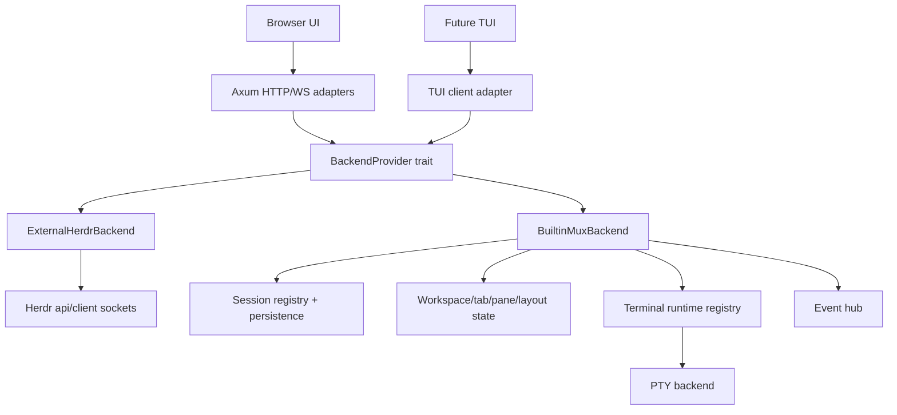

# Built-in Backend Plan

> File name follows the requested `builtint_backend.md` spelling. The feature name in the text is **built-in backend**.

## 1. Current-state verdict

### 1.1 Herdr WebUI backend communication today

The WebUI backend is **not fully behind an interface yet**.

Current shape:

- `src/main.rs` owns most backend communication.
- `WebState` stores socket paths and runtime web settings:
  - `api_socket`
  - `client_socket`
  - `session_name`
  - `herdr_bin`
  - auth/no-sleep/settings/workspace-order state
- `ApiClient` is a small wrapper over Herdr's newline-delimited JSON API socket:
  - `request_value(request: serde_json::Value)`
  - `subscribe(request: serde_json::Value)`
  - `backend_info()`
- HTTP routes manually build raw JSON requests like:
  - `workspace.list`
  - `workspace.create`
  - `worktree.create`
  - `agent.list`
  - `tab.list`
  - `pane.list`
  - `session.snapshot`
- `/ws/events` opens an `events.subscribe` stream to Herdr and also polls snapshots every 5 seconds.
- `/ws/terminal` connects to Herdr's client socket, performs the bincode protocol handshake, sends `AttachTerminal`, then bridges terminal bytes to the browser WebSocket.
- `src/protocol.rs` carries a local copy/subset of Herdr's terminal wire enums and frame helpers.

Conclusion:

- There is a communication wrapper, but no provider trait or backend abstraction.
- Routes are coupled to Herdr JSON method names and response shapes.
- Terminal attach is coupled to Herdr's client socket and wire protocol.
- The right first step is to introduce a backend boundary before adding a built-in backend.

### 1.2 Herdr backend architecture relevant to reuse

Inspected `~/Documents/projects/worktrees/herdr/jcode-support`.

Important pieces:

- API control plane:
  - `src/api/schema.rs`: typed `Request` and `Method` enum.
  - `src/api/schema/*`: typed params/results for workspaces, worktrees, tabs, panes, agents, events, integrations, plugins, session snapshot.
  - `src/api/server.rs`: local socket server over newline-delimited JSON.
  - `src/api/client.rs`: typed reusable API client.
  - `src/app/api.rs`: method dispatcher into app state.
- Event plane:
  - `src/api/event_hub.rs`: append-only event hub, capped at 512 events.
  - `src/api/subscriptions.rs`: subscriptions for workspace/tab/pane/worktree/layout/agent/scroll/output events.
- Terminal plane:
  - `src/protocol/wire.rs`: length-prefixed bincode client/server terminal protocol.
  - `ClientMessage`: `Hello`, `Input`, `ClipboardImage`, `Resize`, `Detach`, `AttachTerminal`, `AttachScroll`, `InputEvents`, `ObserveTerminal`, `ControlTerminal`.
  - `ServerMessage`: `Welcome`, semantic frames, terminal ANSI frames, graphics, shutdown, notifications, clipboard, title, mouse capture.
  - `src/server/client_transport.rs`: maps wire messages to server events and enforces size limits.
  - `src/server/headless.rs`: direct attach, observe, control, takeover, resize locks, foreground client arbitration.
  - `apply_terminal_attach_scroll`: routes scroll to mouse reporting, alternate scroll, or host scrollback.
- Runtime plane:
  - `src/terminal/runtime.rs`: `TerminalRuntime` wrapper around legacy `PaneRuntime` with spawn, resize, scroll, search, read, render, selection, cwd, foreground cwd, child PID.
  - `src/pty/actor.rs`, `src/pty/backend.rs`: platform PTY IO actors and spawn layer.
- Agent support:
  - Jcode exists in detection: `Agent::Jcode`, labels, process identification, sound config, bundled manifest.
  - `src/detect/manifests/jcode.toml` detects Jcode working/blocked/idle states.
  - `agent.start` already supports generic `argv`, `cwd`, `env`, split/workspace/tab placement.
  - Integration install targets do not yet include Jcode, so Jcode is screen/process-detected but not hook-installed from Herdr integration registry.

## 2. Target product behavior

The WebUI should support two backend modes:

1. **External Herdr backend**
   - Current behavior.
   - Talks to `herdr.sock` and `herdr-client.sock`.
   - Remains default until the built-in backend reaches parity.

2. **Built-in terminal multiplexer backend**
   - Runs in the WebUI process or a child process managed by WebUI.
   - Provides Herdr-like functionality: sessions, workspaces, tabs, panes, worktrees, terminal attach, agent detection, agent start/read/send/focus.
   - Uses the same backend contract as the external Herdr adapter.
   - Exposes a client-agnostic control/event/terminal API so a future TUI can drive it without going through browser-specific code.

Mode activation:

- CLI flag: `--backend-mode external-herdr|builtin|auto`.
- Persisted config key in `~/.config/herdr-webui/webui-settings.json`:
  - `backend_mode`
  - `external_api_socket`
  - `external_client_socket`
  - `builtin_autostart`
  - `builtin_storage_dir`
  - `builtin_scrollback_limit_bytes`
  - `builtin_default_shell`
- Settings UI switch updates the config via `/api/server-settings` and restarts/rebinds only what is required.

Future TUI requirement:

- The backend contract must not depend on Axum, WebSocket, DOM, xterm.js, browser clipboard, or browser localStorage.
- WebUI HTTP/WebSocket endpoints are only one client adapter.
- A future TUI should be able to use the same backend through:
  - in-process Rust client API, or
  - local socket JSON/bincode protocol, or
  - a small client crate.

## 3. Functional requirements

### 3.1 Backend selection and lifecycle

- Load backend mode from CLI and persisted settings.
- Support runtime switching from Settings.
- External mode:
  - Resolve named sessions to Herdr socket paths.
  - Keep protocol fallback for compatible Herdr versions.
  - Keep current behavior for session launch/close.
- Built-in mode:
  - Start a backend service if not running.
  - Stop only WebUI-owned built-in services.
  - Preserve running terminal sessions across browser reconnects.
  - Persist enough session state to restore after WebUI restart where feasible.
- Auto mode:
  - Prefer external Herdr if socket is available and compatible.
  - Otherwise start built-in backend.
  - Return explicit capability source in `/api/versions`.

### 3.2 Stable shared backend contract

Define a Rust interface first, then have routes use it:

```rust
#[async_trait]
pub trait BackendProvider: Send + Sync {
    async fn status(&self) -> Result<BackendStatus, BackendError>;
    async fn request(&self, request: BackendRequest) -> Result<BackendResponse, BackendError>;
    async fn snapshot(&self) -> Result<SessionSnapshot, BackendError>;
    async fn subscribe(&self, subscriptions: Vec<Subscription>) -> Result<Box<dyn BackendEventStream>, BackendError>;
    async fn attach_terminal(&self, request: TerminalAttachRequest) -> Result<Box<dyn TerminalStream>, BackendError>;
    async fn shutdown(&self) -> Result<(), BackendError>;
}
```

Required companion types:

- `BackendKind`: `ExternalHerdr`, `Builtin`, `AutoResolvedExternal`, `AutoResolvedBuiltin`.
- `BackendStatus`: version, protocol, capabilities, backend kind, session name, health.
- `BackendCapabilities`: terminal attach, terminal observe/control, worktrees, plugins, integrations, Jcode detection, scroll metrics, terminal selection, session snapshot, layout export/apply.
- `BackendRequest`: typed wrapper around workspace/tab/pane/worktree/agent/layout/session methods.
- `BackendEvent`: typed event enum with stable string names for web compatibility.
- `TerminalStream`: split sender/receiver for terminal controls and terminal frames.

### 3.3 Existing WebUI route compatibility

The browser-facing API should stay compatible:

- `GET /api/workspaces`
- `POST /api/workspaces`
- `GET /api/worktrees`
- `POST /api/worktrees`
- `POST /api/worktrees/open`
- `POST /api/worktrees/remove-path`
- `GET /api/agents`
- `GET /api/tabs`
- `GET /api/panes`
- `GET /api/pane-layout`
- `GET /api/session-snapshot`
- `POST /api/tabs`, rename/close routes
- `POST /api/panes/{pane_id}/close`
- `/ws/events`
- `/ws/terminal`

Routes should call `BackendProvider`, not raw `ApiClient`.

### 3.4 Sessions

- List known sessions.
- Create/launch session.
- Close session safely.
- Track session display names.
- Named session storage separated by session id/name.
- Browser reconnect should attach to existing backend session.
- Future TUI should list and attach to the same sessions.

### 3.5 Workspaces

- Create workspace with optional cwd, label, env, focus flag.
- List/get/focus/rename/move/close workspace.
- Preserve workspace ordering.
- Provide active tab, pane count, tab count, aggregate agent status.
- Enrich workspace cwd/foreground cwd from panes.
- Emit workspace events.

### 3.6 Worktrees

- Discover linked worktrees for a repo.
- Create worktree from branch/base/path/label.
- Open existing worktree path/branch into workspace.
- Remove worktree by workspace id, with force option.
- Keep local Git fallback for external Herdr compatibility only where needed.
- Built-in backend owns Git commands and returns typed errors.
- Protect primary worktree and destructive removals.
- Emit worktree events.

### 3.7 Tabs, panes, layouts

- Create/list/get/focus/rename/move/close tabs.
- Split panes by direction and ratio.
- Focus, close, rename panes.
- Move/swap/resize/zoom panes.
- Export/apply layouts.
- Provide pane process info.
- Emit layout and pane events.

### 3.8 Terminal runtime

- Spawn shell or argv command in a PTY.
- Keep process alive independent from WebSocket connection.
- Attach terminal by terminal id.
- Observe terminal read-only.
- Control terminal writable with takeover semantics.
- Resize with cell dimensions.
- Send raw input bytes and structured input events.
- Send paste as bracketed paste where terminal mode requests it.
- Support clipboard image payloads behind size limits.
- Provide scrollback, scroll metrics, search, visible/recent/history reads.
- Emit scroll change events.
- Render either:
  - terminal ANSI frames for xterm/TUI, or
  - semantic frames for richer clients.

### 3.9 Agent support

- Detect common agents using process name and screen manifest logic.
- Include Jcode support from the `jcode-support` branch:
  - process/label: `jcode`
  - screen manifest states: idle, working, blocked
  - sound/notification override key: `jcode`
- Start agents with generic argv:
  - `name`
  - `argv`
  - `cwd`
  - `workspace_id`
  - `tab_id`
  - split/focus/env
- Send/read/focus/rename agents.
- Explain detection state for debugging.
- Later: add Jcode integration target if Jcode provides hooks or metadata reporting.
- Do not require hook integration for Jcode MVP. Process/screen detection is enough.

### 3.10 Events and subscriptions

- Support subscription stream for:
  - workspace created/updated/renamed/moved/closed/focused
  - worktree created/opened/removed
  - tab created/closed/focused/renamed/moved
  - pane created/closed/focused/moved/exited
  - pane agent detected/status changed
  - pane scroll changed
  - layout updated
  - pane output matched
- Events must carry sequence numbers internally.
- Web adapter may preserve current shape, but internal API should be typed.
- Add resume-after-sequence later to avoid missed events during reconnect.

### 3.11 Settings and config switch

Settings must expose:

- Backend mode: External Herdr, Built-in, Auto.
- External Herdr session/socket paths.
- Built-in backend autostart.
- Built-in storage dir.
- Built-in default shell.
- Built-in scrollback limit.
- Built-in agent presets, including Jcode command.

Settings update behavior:

- Validate config before writing.
- Write config with `0600` on Unix, like current server settings.
- Switching mode should:
  - disconnect terminal sockets,
  - reconnect events,
  - refresh snapshot,
  - keep browser UI state when ids still exist,
  - normalize route when ids do not exist.

### 3.12 Future TUI support

- Provide `herdr_webui_backend` or `mux_backend` Rust module with no Axum dependency.
- Provide a thin local socket server for non-web clients.
- Reuse the same typed control API and terminal wire protocol.
- Allow TUI to subscribe to events and attach/observe/control terminal streams.
- TUI should render from `TerminalAnsi` first, semantic frames optional.
- TUI clipboard/copy mode should use backend-side selection/read APIs, not browser clipboard APIs.

## 4. Non-functional requirements

### 4.1 Terminal session stability

- PTY lifetime must be owned by backend session, not by browser WebSocket.
- WebSocket disconnect must detach, not kill terminal.
- Terminal attach reconnect must send a full current frame first.
- Input sent during reconnect must be rejected or queued explicitly, not silently lost.
- Resize must be idempotent and last-writer-wins per attach/control owner.
- Shutdown must have phases:
  1. stop accepting new clients,
  2. notify clients,
  3. persist snapshot,
  4. terminate owned tasks,
  5. optionally keep PTYs for handoff if supported.
- Every terminal stream must have bounded queues and backpressure.
- No unbounded channel for high-volume terminal frames in built-in mode.

### 4.2 Scroll performance

Current WebUI already has useful behavior:

- Frontend sends backend scroll first.
- Local xterm scroll is fallback.
- PageUp/PageDown map to backend scroll.
- Tail button sends repeated backend down-scroll and scrolls xterm bottom.
- Attach frames are kept hidden until xterm finishes parsing.

Built-in backend must preserve and improve:

- Scroll state lives server-side per terminal.
- `PaneScrollInfo`/equivalent is included in pane info.
- Wheel routing must match Herdr:
  - mouse reporting to child app,
  - alternate scroll to child app,
  - host scrollback when app does not consume wheel/page keys.
- Scroll commands update dirty frame state without regenerating unrelated panes.
- Scrollback storage must be capped by bytes and/or lines.
- Scrollback search must stream or page results. It must not copy the whole buffer for every search.
- Event `pane.scroll_changed` should be emitted after scroll offset changes.

### 4.3 Copy/paste performance

Current WebUI already has useful behavior:

- Desktop paste is captured before xterm default handling.
- Input is chunked to 16 KiB frames.
- WebSocket `bufferedAmount` limits paste pressure.
- Large terminal output is coalesced per animation frame.
- Copy uses `navigator.clipboard.writeText` with a textarea fallback.

Built-in backend must preserve and improve:

- Paste:
  - Bounded chunks.
  - Backpressure against terminal stream.
  - Bracketed paste when terminal input mode supports it.
  - Max paste bytes with clear user error.
  - Do not JSON-encode large binary payloads.
- Copy:
  - Browser client can keep direct xterm selection copy.
  - Backend must expose read/selection APIs for future TUI and remote clients.
  - Selection extraction must operate on row spans and return text without cloning full scrollback.
  - Large copy should have a max byte cap and stream/page option later.
- Clipboard image:
  - Keep payload size limits.
  - Stage image securely in temp dir.
  - Clean temp files.

### 4.4 Render performance

- Support `TerminalAnsi` frames first for xterm and TUI.
- Keep semantic frame path possible for richer clients.
- Maintain a per-client render baseline and dirty-region tracking.
- Small frames should bypass RAF queue on the frontend.
- Large initial attach frames should reveal only after parser callback completes.
- Backend should batch PTY output at a short interval or by byte budget.
- Avoid layout reads on every terminal frame.
- Emit graphics separately or insert before sync end like Herdr.

### 4.5 Protocol compatibility and versioning

- Add backend capabilities to `/api/versions`.
- Version internal backend protocol independently from Herdr protocol.
- External Herdr adapter should continue protocol fallback.
- Built-in backend should start at a new explicit protocol version.
- Generate JSON schema from typed API or keep schema tests that compare expected method names.
- Do not scatter raw method strings in route handlers after the interface refactor.

### 4.6 Security

- Preserve existing WebUI auth and localhost bypass rules.
- External Herdr sockets keep user-only permissions.
- Built-in local socket, if exposed, must use user-only permissions.
- Do not allow arbitrary file writes outside requested workspace operations.
- Git destructive actions require explicit confirmation at UI layer and safe backend validation.
- Terminal attach/control takeover must be explicit.
- Public bind must continue requiring credentials.

### 4.7 Portability

- macOS and Linux are required.
- Windows should be designed in, matching Herdr's portable-pty path, but can be a later milestone.
- PTY backend should be isolated behind an interface so platform gaps do not affect WebUI routes.

### 4.8 Observability

- Log backend mode, protocol, session id, terminal id, attach/detach, queue drops, oversized payload rejection.
- Add counters for:
  - terminal input bytes,
  - terminal output bytes,
  - frame batch sizes,
  - paste chunks,
  - queue wait/drop,
  - scroll commands,
  - reconnects.
- Include backend health in `/api/versions` or new `/api/backend-status`.

## 5. Proposed architecture



### 5.1 Modules to add in WebUI

Suggested files:

- `src/backend/mod.rs`
- `src/backend/provider.rs`
- `src/backend/types.rs`
- `src/backend/external_herdr.rs`
- `src/backend/builtin/mod.rs`
- `src/backend/builtin/session.rs`
- `src/backend/builtin/workspace.rs`
- `src/backend/builtin/worktree.rs`
- `src/backend/builtin/terminal.rs`
- `src/backend/builtin/agent.rs`
- `src/backend/builtin/events.rs`
- `src/backend/terminal_wire.rs`
- `src/backend/config.rs`

### 5.2 External Herdr adapter

Move current code into adapter:

- `ApiClient` request/subscribe.
- Socket path resolution.
- Protocol fallback.
- Terminal attach handshake.
- `terminal_text_messages` mapping.
- Worktree API compatibility.

Routes then call adapter through trait.

### 5.3 Built-in backend internals

Core structs:

```rust
pub struct BuiltinMuxBackend {
    sessions: SessionRegistry,
    workspaces: WorkspaceStore,
    terminals: TerminalStore,
    events: EventHub,
    config: BuiltinBackendConfig,
}
```

Responsibilities:

- `SessionRegistry`: session ids, persistence dirs, lifecycle.
- `WorkspaceStore`: workspaces, tabs, panes, layouts, focus state.
- `TerminalStore`: PTY runtimes, attach owners, scrollback, render baselines.
- `EventHub`: typed sequence events and subscriptions.
- `AgentRegistry`: detection manifests, process/screen state, agent presets.

### 5.4 PTY and terminal rendering choices

Preferred long-term option:

- Extract/adapt Herdr terminal/PTY/runtime code into a reusable crate or internal module.
- Keep protocol semantics aligned with Herdr.
- This minimizes divergence for scroll, selection, agent detection, and terminal modes.

Fallback MVP option:

- Implement raw PTY -> xterm ANSI streaming first.
- Add full scrollback/search/selection/layout after.
- This is faster but will not meet “same functionality as Herdr” without later runtime parity work.

Recommendation:

- Start with the interface and external adapter first.
- Then port/extract runtime code selectively, not a quick raw-PTY-only implementation.

## 6. Iteration plan

### Phase 0: Interface extraction, no behavior change

Goal: current external Herdr behavior behind `BackendProvider`.

Tasks:

1. Add backend module and trait.
2. Move `ApiClient` into `backend/external_herdr.rs`.
3. Move Herdr terminal wire/protocol copy into `backend/terminal_wire.rs`.
4. Convert route handlers to call `BackendProvider` methods.
5. Keep response JSON shapes unchanged.
6. Add tests for route output equivalence using fake provider.

Acceptance criteria:

- `cargo test` passes.
- Existing browser still works with external Herdr.
- No route handler manually opens Herdr sockets.
- Raw method strings are isolated to external adapter or typed conversion layer.

### Phase 1: Config and settings switch

Goal: user can select backend mode, but built-in mode can initially return “not implemented”.

Tasks:

1. Add `backend_mode` and built-in config fields to persisted settings.
2. Add CLI `--backend-mode`.
3. Extend `/api/server-settings` GET/POST.
4. Add Settings UI switch.
5. Add `/api/backend-status` or extend `/api/versions`.
6. Implement reconnect flow after mode switch.

Acceptance criteria:

- Settings writes config.
- Invalid config is rejected before write.
- Switching mode disconnects terminal/event sockets and refreshes cleanly.
- External Herdr remains default.

### Phase 2: Shared typed API contract

Goal: make API client-agnostic for WebUI and future TUI.

Tasks:

1. Define typed `BackendRequest`, `BackendResponse`, `BackendEvent`.
2. Map WebUI routes to typed requests.
3. Map external Herdr typed requests to Herdr JSON methods.
4. Add capability negotiation.
5. Add schema snapshot tests.

Acceptance criteria:

- Web routes do not construct arbitrary `serde_json::Value` except adapter boundary.
- Future TUI can call backend trait without Axum types.
- Capabilities report which backend mode and features are active.

### Phase 3: Built-in session/workspace/tab/pane skeleton

Goal: built-in backend can create/list/focus/rename/close workspaces/tabs/panes without PTY parity yet.

Tasks:

1. Add in-memory `BuiltinMuxBackend`.
2. Add session registry.
3. Add workspace/tab/pane ids and focus model.
4. Add event hub.
5. Add snapshot generation.
6. Add persistence format for session skeleton.

Acceptance criteria:

- Built-in mode shows workspace list.
- Create/rename/close workspace works.
- Create/rename/close tab works.
- Pane list and session snapshot work.
- Events update UI without polling-only behavior.

### Phase 4: Built-in PTY terminal runtime MVP

Goal: spawn shell panes and attach from WebUI.

Tasks:

1. Add PTY spawn abstraction.
2. Spawn default shell in root pane.
3. Stream ANSI output to `/ws/terminal`.
4. Send input, resize, detach.
5. Keep PTY alive across WebSocket reconnect.
6. Add scrollback ring buffer and full attach repaint.
7. Add bounded queues/backpressure.

Acceptance criteria:

- Terminal survives browser refresh.
- Input works.
- Resize works.
- Detach does not kill PTY.
- Large output does not allocate unbounded memory.
- Paste is chunked and backpressured.

### Phase 5: Herdr-like terminal semantics

Goal: close functional gap with Herdr terminal behavior.

Tasks:

1. Implement server-side scroll offset and scroll metrics.
2. Implement wheel routing:
   - mouse report,
   - alternate scroll,
   - host scrollback.
3. Add read visible/recent/history APIs.
4. Add output wait/match.
5. Add selection extraction for TUI/backend copy mode.
6. Add terminal search.
7. Add render baseline/diff frames.
8. Add observe/control/takeover.

Acceptance criteria:

- PageUp/PageDown and wheel work in normal and alternate screen.
- `pane.read` works.
- `pane.wait_for_output` works.
- TUI can copy selection without browser clipboard.
- Multiple clients can observe; one client controls unless takeover.

### Phase 6: Worktrees and Git operations

Goal: built-in mode can manage linked worktrees like external Herdr.

Tasks:

1. Implement repo discovery.
2. Implement `worktree.list`.
3. Implement create/open/remove.
4. Preserve existing branch behavior.
5. Protect primary worktree.
6. Emit worktree events.
7. Integrate existing WebUI Git fallback logic into backend-owned implementation.

Acceptance criteria:

- Worktree create/open/remove works in built-in mode.
- Existing branch create works natively.
- Errors are typed and UI-friendly.
- Destructive actions require confirmation and backend validation.

### Phase 7: Agents and Jcode support

Goal: built-in mode supports a wide range of agents and Jcode.

Tasks:

1. Port/adapt detection agent enum and manifest loader.
2. Include Jcode manifest.
3. Identify foreground process and screen state.
4. Implement agent list/get/read/send/focus/rename/explain.
5. Implement agent start from generic argv/env/cwd.
6. Add agent presets in config, including Jcode.
7. Later: add optional Jcode integration target if hooks become available.

Acceptance criteria:

- Running `jcode` is detected as Jcode.
- Jcode idle/working/blocked screen states are detected.
- Agent start can launch Jcode with configured argv.
- Agent read/send/focus work.
- UI no-sleep/notifications see Jcode states.

### Phase 8: Future TUI client

Goal: prove backend is not browser-coupled.

Tasks:

1. Add local socket endpoint for built-in backend control API.
2. Add minimal Rust client library.
3. Build small smoke-test CLI/TUI prototype:
   - list sessions,
   - list workspaces,
   - attach terminal ANSI stream,
   - send input,
   - detach.
4. Verify no Axum/browser dependency in backend core.

Acceptance criteria:

- Prototype can attach to built-in backend without WebUI.
- Same terminal session can be seen by WebUI and prototype.
- Event subscription works outside browser.

### Phase 9: Hardening and parity

Goal: make built-in backend stable enough to expose as a real option.

Tasks:

1. Stress test long-running PTY output.
2. Stress test large paste.
3. Stress test reconnect/detach/reattach.
4. Test simultaneous WebUI and TUI clients.
5. Fuzz/proptest terminal frame protocol decode limits.
6. Add memory benchmarks for scrollback.
7. Add migration docs.
8. Keep external Herdr fallback.

Acceptance criteria:

- No unbounded memory growth under large output.
- Reconnect does not kill terminals.
- Clipboard and paste stay responsive.
- Scrollback operations stay bounded.
- Built-in backend can be enabled from Settings without manual config edits.

## 7. Test plan

### 7.1 Unit tests

- Backend mode parsing and validation.
- Settings load/save migration with missing keys.
- Provider fake route tests.
- Typed request to external Herdr JSON mapping.
- Event subscription matching.
- Worktree path safety.
- Agent detection, including Jcode manifest samples.
- Terminal protocol frame size limits.

### 7.2 Integration tests

- External Herdr adapter against fake local socket.
- Built-in backend workspace/tab/pane lifecycle.
- Built-in terminal spawn/attach/input/resize/detach.
- WebSocket terminal reconnect.
- Event stream reconnect.
- Worktree create/open/remove in temp Git repos.

### 7.3 State-space tests

Model workspace/tab/pane operations:

- create/focus/rename/move/close
- split/move/close/zoom
- random valid operation sequences
- invariants:
  - one focused workspace when non-empty,
  - one active tab per workspace,
  - focused pane belongs to active tab,
  - no dangling pane/terminal ids,
  - closing a pane cleans runtime or transfers safely.

Model terminal client lifecycle:

- connect, attach, input, resize, scroll, disconnect, reconnect, takeover, observe, close.
- invariants:
  - PTY alive until pane close,
  - only one writable owner unless takeover,
  - observers cannot send input,
  - scroll offset within bounds,
  - detach does not kill process.

### 7.4 Performance tests

- Large output: generate 100 MiB of terminal output and ensure memory is bounded by scrollback config.
- Large paste: paste 10 MiB and verify chunking/backpressure, no UI freeze beyond target threshold.
- Attach frame: measure first paint/reveal after reconnect.
- Scroll: wheel/page key burst should not allocate proportional to full scrollback.
- Copy: copy selected range from large scrollback without cloning full buffer.

Target initial thresholds:

- Small frame input-to-write path avoids RAF where possible.
- Paste chunks: 16 KiB.
- WebSocket buffered amount gate: 64 KiB to 1 MiB depending client path.
- Scrollback memory bounded by configured byte limit.

## 8. Risks and mitigations

| Risk | Mitigation |
| --- | --- |
| Built-in backend diverges from Herdr semantics | Extract interface first, map behavior to Herdr schema, port terminal concepts deliberately. |
| Terminal runtime becomes too large for WebUI | Keep backend modules isolated; consider shared crate extraction. |
| Unbounded terminal output memory | Ring buffer by bytes, bounded queues, explicit drop/backpressure policy. |
| Browser/TUI API split | Define client-agnostic provider API before built-in implementation. |
| Jcode hook integration not present | Support Jcode via process/screen detection and generic argv first. Add hooks later. |
| Settings switch kills sessions | Treat switch as client reconnect; do not stop external Herdr; stop built-in only when explicitly owned and requested. |
| Worktree destructive operations | Keep confirmations and backend safety checks. |
| Codebase memory Herdr index timeout | Use direct code evidence for plan now; retry graph indexing before implementation. |

## 9. Implementation iteration 2026-07-12

Completed in this iteration:

1. Added `src/builtin_backend.rs` with a local socket API and local socket terminal transport compatible with the current WebUI route and `/ws/terminal` bridge.
2. Added built-in backend mode selection:
   - persisted `backend_mode`,
   - persisted `builtin_shell`,
   - CLI `--backend-mode <external-herdr|builtin|auto>`,
   - Settings UI controls,
   - `/api/versions.backend_mode`.
3. Kept external Herdr as the default and kept all existing socket behavior for `external-herdr`.
4. Implemented built-in workspace/tab/pane lifecycle basics:
   - default workspace and tab,
   - list/create/rename/close workspace,
   - list/create/rename/close tab,
   - pane list/get/layout/close/read,
   - session snapshot.
5. Implemented PTY runtime MVP using `portable-pty`:
   - spawn shell or agent argv,
   - stream ANSI output,
   - send input and paste events,
   - resize,
   - detach/reconnect without killing the PTY,
   - bounded 8 MiB byte scrollback,
   - full attach repaint.
6. Hardened terminal transport basics:
   - max frame size kept at 32 MiB,
   - terminal subscribers use bounded sync queues,
   - slow/full subscribers are disconnected instead of blocking PTY reader,
   - drop path kills owned PTY child,
   - built-in frontend scroll uses xterm local scroll and avoids sending backend scroll spam,
   - built-in socket paths fall back to hashed temp paths when config paths exceed Unix socket limits,
   - startup refuses to unlink an active existing socket, only stale sockets are reclaimed.
7. Added worktree MVP:
   - `worktree.list` via `git worktree list --porcelain`,
   - `worktree.open`,
   - `worktree.create` via `git worktree add -b`.
8. Added agent detection/status MVP:
   - argv aliases aligned with Herdr's current agent list plus Jcode,
   - terminal-tail fallback for shell-launched Jcode/OpenCode,
   - Jcode blocked/working/idle patterns ported from Herdr `jcode-support:src/detect/manifests/jcode.toml`,
   - OpenCode blocked/working patterns aligned with Herdr `src/detect/manifests/opencode.toml`,
   - detection scans a bounded 64 KiB ANSI-stripped tail, not full scrollback.
9. Added tests:
   - backend mode parsing/settings/API tests,
   - built-in socket override test,
   - Jcode/OpenCode detection pattern tests,
   - Herdr agent alias tests,
   - ANSI strip test,
   - git worktree porcelain parse test,
   - JS Settings UI and built-in scroll-path tests.

Validation for this iteration:

- `cargo test` passes: 106 tests.
- `node --test src/assets/*.test.mjs` passes: 145 tests.
- Live smoke passes: built-in mode starts with temp config, `/api/versions` reports compatible built-in backend, and direct built-in API socket `ping` returns `pong`.

Intentional limitations still tracked:

1. No full `BackendProvider` trait extraction yet. The built-in backend is socket-compatible, which reduces frontend disruption, but route handlers still know about external socket APIs.
2. Built-in `events.subscribe` is an acked placeholder. UI still gets current state through existing route refresh paths, but true event push remains required for parity.
3. Built-in scroll is browser/xterm-local only. Server-side scroll, selection extraction, terminal search, and diff render frames remain Phase 5.
4. Foreground process detection is not yet Herdr-equivalent. Shell-launched agents are inferred from terminal tail. True foreground process inspection remains needed.
5. Worktree remove is not implemented in the built-in API yet. Destructive built-in worktree operations must wait for confirmation and safety validation.
6. Persistence is only settings-level. Built-in mux session/workspace persistence remains to be implemented.
7. Future TUI can connect to the same local sockets, but a typed client library and event stream still need to be built.

Next checklist:

1. Extract `BackendProvider` and move external Herdr socket code behind an adapter.
2. Add typed request/response/event structs shared by WebUI and future TUI.
3. Implement built-in event hub and live event subscription.
4. Add server-side scroll/copy/search/read parity.
5. Add foreground process detection for all Herdr manifest agents.
6. Add built-in worktree remove with safety checks.
7. Add PTY stress tests for reconnect, large output, large paste, and multi-client attach.

## 10. Evidence map

Codebase-memory status:

- Indexed WebUI backend as `herdr-webui-backend` successfully before source inspection.
- Herdr `jcode-support` graph indexing timed out at the tool boundary, so Herdr conclusions were verified by direct source reads from the existing repo.
- Requested “jcode branch” appears locally as `jcode-support` in `~/Documents/projects/herdr`; `integration/jcode-reset` also exists but was not used for this implementation.

WebUI files inspected:

- `src/main.rs`
  - `WebState`, `ApiClient`, `EventStream`
  - routes in `app_router`
  - socket path helpers
  - workspaces/worktrees/tabs/panes/agents routes
  - `/ws/events`
  - `/ws/terminal`
  - terminal protocol fallback
  - settings load/save and update routes
- `src/protocol.rs`
  - length-prefixed bincode helpers
  - terminal wire enums
- `src/assets/desktop/app_js/terminal.js`
  - terminal attach WebSocket
  - frame coalescing
  - backend scroll
  - paste chunking/backpressure
  - copy fallback
- `src/assets/mobile/terminal.js`
  - mobile terminal attach
  - frame coalescing
  - paste chunking
- `src/assets/shared/terminal_scroll.js`
  - shared scroll helpers

Herdr `jcode-support` files inspected:

- `src/api/schema.rs`
- `src/api/schema/workspaces.rs`
- `src/api/schema/worktrees.rs`
- `src/api/schema/agents.rs`
- `src/api/schema/events.rs`
- `src/api/schema/panes.rs`
- `src/api/schema/response.rs`
- `src/api/schema/integrations.rs`
- `src/api/server.rs`
- `src/api/client.rs`
- `src/api/event_hub.rs`
- `src/api/subscriptions.rs`
- `src/app/api.rs`
- `src/protocol/wire.rs`
- `src/server/client_transport.rs`
- `src/server/headless.rs`
- `src/server/render_stream.rs`
- `src/terminal/runtime.rs`
- `src/terminal/state.rs`
- `src/pty/actor.rs`
- `src/pty/backend.rs`
- `src/detect/mod.rs`
- `src/detect/manifest.rs`
- `src/detect/manifests/jcode.toml`
- `src/integration/registry.rs`
- `src/integration/types.rs`
- `src/cli/agent.rs`
