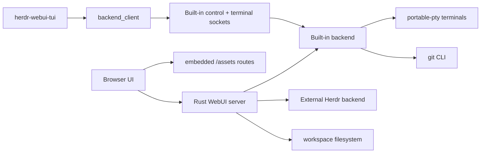

# Technical details

This document records implementation decisions, feature behavior, settings, and performance boundaries for Herdr WebUI.

## Architecture

Herdr WebUI is a Rust Axum server with embedded static assets. The browser connects to Herdr through HTTP and WebSocket endpoints exposed by the WebUI process.

The built-in backend is the default runtime for new settings. External Herdr stays as a compatibility backend selected through settings or CLI flags. Both backends flow through the WebUI server adapter so browser code can keep one high-level API.

The session manager adds a per-request backend target on top of the global default. Browser HTTP calls include `x-herdr-backend: builtin|external-herdr`; terminal and event WebSockets include `backend=builtin|external-herdr` query data because browsers cannot set custom WebSocket headers. The server still owns routing: external targets resolve to Herdr config sockets, built-in targets resolve to WebUI built-in socket namespaces and lazily start a built-in backend handle when launched.

### Built-in backend architecture

- `src/builtin_backend.rs` owns built-in runtime state: workspaces, tabs, panes, terminals, agent metadata, worktree helpers, local socket listeners, request dispatch, and Jcode/OpenCode status detection.
- `src/builtin_events.rs` owns the built-in event hub and pane event context. This keeps publish/subscribe fan-out separate from backend request handling and terminal PTY code.
- Built-in control requests are newline-delimited JSON. Supported methods include `ping`, `session.snapshot`, workspace/tab/pane CRUD basics, `pane.read`, `agent.list/start`, and worktree list/open/create.
- Built-in terminal attach uses `src/protocol.rs` frames over a separate local socket. The protocol supports attach, ANSI output, input, paste, resize, detach, and server shutdown frames.
- The browser adapter in `src/main.rs` chooses sockets from the effective backend target. Without an explicit target it follows `backend_mode`; with `x-herdr-backend` or `backend=` query data it routes that request to the selected built-in or external Herdr session. Built-in mode must not accidentally route `/ws/events` or `/ws/terminal` to external Herdr session sockets, and external Herdr selections must still work from a WebUI process whose default is built-in.
- Built-in sessions are stored in a small handle registry keyed by session name. The registry keeps each in-process built-in backend alive while it is running and allows the browser WebUI and TUI/smoke clients to attach in parallel. Closing a built-in session removes its handle; the handle drop unblocks socket listeners and cleans sockets.
- Built-in sessions do not seed a default workspace during `BuiltinState::new`. A fresh backend socket returns an empty `session.snapshot`; UI surfaces must handle zero workspaces and use `default_folder` for Files, Git, temporary terminals, and workspace/worktree pickers until the user explicitly opens or creates a workspace.
- `pane.read` returns terminal text after common TUI rewrites: carriage return, clear-line/display, cursor movement, OSC title skipping, and ANSI/control stripping. This keeps cleared Jcode toolbars/status cards from becoming stale plain text.
- Agent detection first inspects known argv labels, then scans terminal child process trees with a short process-table cache, then falls back to terminal-screen markers. Jcode status follows the Herdr `jcode-support` manifest bottom-line rules plus active background-task markers so running tasks remain `working` even when an input prompt is visible.
- Built-in `events.subscribe` stays open through an in-process event hub. Workspace, tab, pane, worktree, and agent status mutations publish Herdr-shaped JSON events to subscribers. The WebUI bridge uses those events for built-in sessions instead of its legacy 5s snapshot polling branch; external Herdr sessions keep the existing compatibility behavior.
- Status detection stays backend-core owned, not WebSocket-owned. PTY/process/status detectors publish internal state-change events, then WebSocket, TUI, and smoke clients consume through backend/client APIs. This keeps TUI/headless clients first-class and keeps status tests independent from browser transport.
- xterm.js terminal query replies are treated as frontend input sanitation, not backend color logic. Native terminals consume OSC 10/11 color query responses internally, but xterm.js can expose those responses through `onData`. WebUI filters those replies before they reach the terminal WebSocket so they cannot be written into the PTY as shell input.
- Unsafe destructive operations stay explicit. `worktree.remove` returns unsupported until validation, preview, and rollback rules are implemented.

### TUI/client modularity

The TUI is intentionally separated from backend internals:

- `src/backend_client.rs` is the reusable client boundary. It knows socket paths, JSON request/response wrapping, terminal frame IO, and error types. It does not render UI.
- `src/tui.rs` owns TUI application state, refresh flow, selection, text snapshot rendering, and terminal attach/input orchestration. It consumes `BackendClient` and backend JSON, but does not know `BuiltinBackendInner` internals.
- `src/tui_model.rs` owns TUI DTOs and backend snapshot parsing. `src/tui_input.rs` maps keys to terminal bytes and menu shortcuts. `src/tui_render.rs` owns Ratatui widget rendering. `src/tui_tests.rs` keeps TUI app/render regression coverage out of the production module.
- `src/bin/herdr-webui-tui.rs` is a thin binary shell for CLI parsing, terminal raw mode, the event loop, and the live terminal reader/writer thread.
- Terminal text parsing is split by responsibility. `src/terminal_text.rs` provides shared plain-text terminal rewrite handling for backend snapshots. `src/tui_terminal.rs` provides styled ANSI SGR parsing for Ratatui color spans, with parser regression tests in `src/tui_terminal_tests.rs`.
- TUI theme selection is isolated in `src/tui_theme.rs`. The CLI accepts `dark`, `light`, or `system`, with `system` querying the terminal background before raw mode and falling back to dark for unsupported terminals or non-interactive smoke runs.
- This separation keeps SOLID boundaries: backend runtime has one reason to change, client transport has one reason to change, TUI state/rendering has one reason to change, and the binary only wires them together.
- New TUI features should add typed wrappers to `BackendClient` before adding UI controls. Avoid calling built-in backend internals from `tui.rs` or the binary.
- Herdr-like feature parity should be implemented as original UI/controller code over this client layer, not by copying Herdr source.

### Backend responsibilities

- Serve embedded HTML, CSS, JavaScript, fonts, and icons from `src/assets.rs` and `src/main.rs` routes.
- Validate file paths before reading or writing.
- List file explorer entries and file search results.
- Calculate Git status for files and directories before sending file tree data.
- Run Git UI operations, diffs, comparisons, cleanup scans, and worktree operations.
- Proxy terminal/session protocol messages to compatible Herdr versions.

### Frontend responsibilities

- Render panes, tabs, sidebars, file trees, editor surfaces, terminal surfaces, and modals.
- Store browser-local UI options in `localStorage`.
- Preserve transient panel state while workspaces/worktrees stay open.
- Keep CodeMirror preview and edit mode behavior consistent.
- Load shared modules once through `app_boot.js`.

## Static asset model

The Rust binary embeds assets with `include_str!` or `include_bytes!`. Public routes are explicit, for example:

- `/assets/app-boot.js`
- `/assets/shared/core.js`
- `/assets/shared/colors.css`
- `/assets/shared/content-search.css`
- `/assets/shared/file-icons.js`
- `/assets/shared/file-icons.css`
- `/assets/shared/file-tree.js`
- `/assets/shared/file-content-search.js`
- `/assets/shared/workspace-search.js`
- `/assets/vendor/codemirror.js`
- `/assets/shared/editor.js`
- desktop assets under `/assets/desktop/...`
- mobile assets under `/assets/mobile/...`

`app_boot.js` loads layout CSS, then shared color tokens, shared icon CSS, shared content-search CSS, shared JS, and finally layout-specific JS. File icon data is a shared module loaded before `file-tree.js`, so desktop and mobile use the same mappings. Content-search and workspace-search helpers are also shared, with desktop and mobile owning only controller state and backend calls.

## File explorer

### Search with folder context

When searching files or folders from the header search, the UI does not flatten matching paths into a pathless list. It rebuilds the parent directory chain for each match. This keeps the path visible without requiring the full tree to stay expanded.

### Git status propagation

The backend runs one Git porcelain status scan per refresh, maps changed paths, then propagates status to parent folders.

Priority:

1. Deleted or missing paths -> red.
2. Modified, renamed, copied, type changed, conflicted -> yellow.
3. Added or untracked -> green.

The priority is monotonic while walking parents. A parent folder keeps the highest-priority child status. Refresh retriggers calculation from current Git state.

### Why backend calculation

Git status and path propagation depend on repository state, ignore rules, renames, untracked files, and deleted paths. Doing it in Rust avoids browser-side tree scans, avoids duplicate desktop/mobile logic, and returns ready-to-render entries.

### Workspace/worktree state

File explorer state is cached per open workspace/worktree identity. It preserves:

- selected file,
- search selections and last opened result,
- content-search result tab state,
- split pane sizes,
- editing mode,
- unsaved edit draft,
- dirty flag.

When a workspace or worktree closes, the cached state is forgotten. Async file fetches write back to the captured workspace state, so switching panels does not corrupt another workspace panel.

### Folder picker UX

Desktop file browser and the folder picker both use the shared `file-tree.js` current-directory row for the active folder and its `↑ Up` control. This avoids a separate `dir up` tree row that looked like content and behaved inconsistently. The visible picker actions intentionally expose Home and Select only; absolute paths are still supported when typed/pasted, but the UI does not encourage jumping to `/` over the configured default folder.

### Temporary terminal input

The temporary terminal overlay is implemented in `src/assets/shared/temp_terminal.js` for desktop and mobile. While open, xterm.js keeps ownership of focused terminal key events so shell completions, prompts, and line rewrites use the same terminal parser path as normal terminals. If focus escapes the terminal surface, the overlay captures normal key input, Tab, Backspace, arrows, and paging keys before browser focus navigation can steal them, then forwards the terminal byte sequence to the temporary terminal websocket. The overlay clamps the modal, terminal body, and xterm surface to the viewport and sizes PTY rows with a one-row safety margin so output does not grow below the visible area. `Ctrl+G` opens the detach confirmation, matching the header hint next to the close button and the Help & Shortcuts modal.

### Unified header search

The header search is the single search entry point on desktop and mobile. It can render these collapsible sections in a configurable order:

- workspaces/worktrees/repos/agents/panels from browser state, shown only after a non-empty query,
- file names for the focused workspace/worktree from backend tree search,
- folder names for the focused workspace/worktree from backend tree search,
- file-content matches for the focused workspace/worktree from backend content search.

Workspace/worktree matching uses repo names/keys/roots, tags/labels, branch names, panel names, workspace labels, agent names, and IDs. An empty search does not show workspace/worktree rows, avoiding a noisy unfiltered list.

`src/assets/shared/workspace_search.js` owns shared settings normalization, backend request helpers, parent-aware tree rendering for path results, content-result picker rendering, and match highlighting. Desktop `src/assets/desktop/search.js` and mobile `src/assets/mobile/app.js` own only controller state, keyboard/touch handling, and opening selected results. If a section is disabled in Settings, the controller does not request that data.

Keyboard behavior:

- prefix then `/` or the header magnifier opens search,
- arrows move through visible results,
- Enter opens the selected target, path result, or content match,
- Esc closes search,
- `Alt+F` selects the file-name section,
- `Alt+D` selects the folder-name section,
- `Alt+1`, `Alt+2`, and `Alt+3` toggle the workspaces, files, and content sections,
- `Alt+↑` and `Alt+↓` request more content context above or below the selected content match.

Opening a content match calls the file browser with path, line, and query highlight data. The file opens in the same read-only CodeMirror surface used by normal previews and scrolls to the matched line when supported.

### Content search

Content search uses backend-owned repository traversal and matching. Results render in the unified header search and in the file explorer content-result renderer when a dedicated content panel is needed. Routes:

- `GET /api/file-browser/content-search`: bounded breadth-first scan from the current file tree root, grouped by file.
- `GET /api/file-browser/content-search/file`: lazy full match load for one file when the group is expanded.
- `POST /api/file-browser/content-search/snippet`: hash-guarded line-range save for an edited match snippet.

Browser-local configurable values:

- `searchWorkspacesEnabled`: enables/disables workspace/worktree/panel results,
- `searchFilesEnabled`: enables/disables file-name results,
- `searchFoldersEnabled`: enables/disables folder-name results,
- `searchContentEnabled`: enables/disables file-content results,
- `searchSectionOrder`: comma-separated section order. Valid values are `workspaces`, `files`, and `content`,
- `fileBrowserSearchPageSize`: file/folder result page size sent as `limit`,
- `fileContentSearchMinChars`: minimum characters before content search runs,
- `fileContentSearchPageSize`: content result file groups per lazy page,
- `fileContentSearchContextLines`: default lines above/below each match,
- `fileContentSearchAutoCollapseFiles`: file-count threshold for collapsed result groups,
- `fileContentSearchDefaultExpanded`: whether content result file groups expand when results load,
- `fileContentSearchMatchesPerFile`: initial matches included per file before lazy full-file expansion,
- `fileContentSearchMatchCase`: whether backend content search treats case as significant,
- `fileContentSearchRegex`: whether backend content search interprets the query as a regular expression.

Performance limits:

- dependency/build folders such as `.git`, `node_modules`, `target`, `dist`, `build`, `.venv`, and `venv` are skipped,
- traversal is capped by `MAX_CONTENT_SEARCH_VISITS`,
- file reads are skipped above `MAX_CONTENT_SEARCH_FILE_BYTES`,
- binary/NUL content is skipped,
- result page size, context lines, and matches per file are clamped server-side,
- invalid regex queries return HTTP 400 before traversal.

Desktop and mobile pass `match_case` and `regex` to the backend routes. Backend matching is implemented once in Rust, so the browser does not scan file content or run repository-wide regexes. Desktop and mobile use `src/assets/shared/file_content_search.js` for grouped rendering, highlight markup, per-file disclosure arrows, merged line chunks, and Git-diff-style context arrows. File results are grouped once per file. New file groups honor `fileContentSearchDefaultExpanded`; when enabled they expand unless `fileContentSearchAutoCollapseFiles` collapses a large result set. Expanded files show matching lines by default, surrounding context lines when available, and up/down arrows that request more context. When expanded context overlaps adjacent matches, the renderer merges the rows into one continuous chunk. Shared visual rules live in `src/assets/shared/content_search.css` and shared colors live in `src/assets/shared/colors.css`, so desktop/mobile do not duplicate the match highlight palette. The frontend does not scan repository content. It only sends queries, renders grouped results, and mounts editor instances for highlighted full-file opens.

### Theme tokens

Shared theme extension tokens live in `src/assets/shared/colors.css`. New feature colors should use these or existing base variables instead of local hardcoded palettes. Current shared tokens cover focus rings, search hit foreground/background/border/shadow, content match row background/border, and editor-style panel background.

### File preview and editing

File open uses the same CodeMirror shell as edit mode from the first render. Preview is read-only by default. Edit only changes the editable state and enables save behavior. Cancel returns to the same read-only editor style.

Text files show line numbers by default. The setting can disable them.

### File icons

File icon logic is split into:

- `src/assets/shared/file_icons.js`: file name and extension mapping for file glyphs.
- `src/assets/shared/file_icons.css`: neutral monochrome glyph styling that inherits row color. Normal rows stay grey; Git status rows can color the whole row.
- `src/assets/shared/file_tree.js`: rendering only, with fallback when icon module is unavailable.

No external icon assets are copied. The implementation uses local CSS and short glyph labels for files. Folders keep the plain folder SVG and only change color through backend Git status row classes.

### Git UI structure

The Git sidebar separates exclusive view selection from action commands. Changes, log, stash, and cleanup render as a segmented toggle styled like the workspace shell-mode controls. Worktree actions remain in the toolbar below that toggle, and the file filter is rendered under the action toolbar so filtering applies to the visible file lists without visually competing with view switching. Cleanup uses `src/assets/icons/broom.svg` as a single shared mask icon instead of composing broom/trash glyphs in CSS.

Git cwd is independent from workspace selection only when the user explicitly picks a different Git directory. Each cached Git view stores both `workspaceCwd` and current `cwd`:

- initial open sets both values from the selected workspace/worktree or the default-folder pseudo-workspace,
- choosing a directory from the Git picker calls `applyBranchModalCwd`, updates `cwd`, clears stale file/diff/log selection state, and refreshes,
- switching branches uses the current `cwd` and does not also mean selecting a different folder,
- the `↩` return action is visible only when normalized `cwd !== workspaceCwd`, and resets `cwd` back to the active workspace/worktree folder.

This avoids two competing actions over one path field and keeps Git drawer state predictable when browsing repositories outside the currently selected workspace.

## Editor

The editor stack is CodeMirror. The WebUI preloads `/assets/vendor/codemirror.js` before `/assets/shared/editor.js` so file open can create a CodeMirror DOM immediately.

Supported behavior:

- read-only preview with CodeMirror style,
- edit mode with the same style,
- syntax highlighting by detected language,
- fold gutter and folding keymaps for compatible languages,
- default line numbers for text preview,
- high-contrast syntax palette tokens for light and dark themes,
- match-line highlight/scroll when opening a content-search result,
- find toolbar in read-only preview and edit mode, with next/previous, match-case, and regex search,
- replace-one and replace-all controls in edit mode only,
- fallback numbered `<pre>` rendering if CodeMirror fails to load.

## Settings

Browser-local settings are stored in `localStorage` under `herdr-web-options`. Runtime server settings are stored in `~/.config/herdr-webui/webui-settings.json`. Main browser defaults are defined in `src/assets/desktop/app_js/core.js`; fresh runtime server settings default to `backend_mode: builtin` with both backend types enabled.

| Setting | Default | Notes |
| --- | --- | --- |
| `overflow` | `false` | Browser terminal overflow opt-in. |
| `notificationVolume` | `0.24` | Clamped 0 to 1. |
| `browserNotifications` | `false` | Browser notification permission still applies. |
| `shiftEnterNewline` | `true` | Terminal input newline behavior. |
| `closeShortcut` | `off` | Optional close shortcut mode. |
| `globalShortcutsEnabled` | `true` | Enables WebUI global shortcuts. |
| `globalShortcutPrefix` | app default | Prefix for global shortcuts. |
| `webuiShortcuts` | app default | User-overridable shortcut map. |
| `gitShortcuts` | app default | Git UI shortcut map. |
| `searchShortcut` | `off` | Optional search prefix. |
| `terminalFontFamily` | bundled Nerd Font stack | Migrates old monospace default. |
| `terminalLinks` | `true` | Terminal link detection. |
| `agentSortMode` | `off` | Optional attention/status sorting. |
| `agentStatusOrder` | blocked, idle, done, other, working | Custom status grouping order. |
| `sidebarWorkspacePercent` | `68` | Clamped 20 to 80. |
| `parentCloseMode` | `panels` | Parent close policy. |
| `stuckWorkingEnabled` | `true` | Stuck-working warnings. |
| `workingDismissMinutes` | `30` | Clamped 1 to 1440. |
| `workspaceSort` | `default` | Workspace ordering. |
| `scrollLines` | `3` | Terminal wheel/key scroll step, clamped 1 to 20. |
| `treeIndentPx` | `14` | File tree indent, clamped 0 to 40. |
| `fileBrowserAllowParent` | `true` | Show parent navigation. |
| `fileBrowserGitStatus` | `true` | Show backend-provided Git colors. |
| `fileBrowserLineNumbers` | `true` | Show line numbers in file previews. |
| `searchWorkspacesEnabled` | `true` | Show workspace/worktree/panel results in unified header search. |
| `searchFilesEnabled` | `true` | Show backend file-name results in unified header search. |
| `searchFoldersEnabled` | `true` | Show backend folder-name results in unified header search. |
| `searchContentEnabled` | `true` | Show backend file-content results in unified header search. |
| `searchSectionOrder` | `workspaces,files,content` | Section order for unified header search. Invalid or missing values are normalized. |
| `fileBrowserSearchPageSize` | `100` | File/folder search page size, clamped 10 to 500. |
| `fileContentSearchMinChars` | `3` | Minimum characters before content search runs, clamped 1 to 20. |
| `fileContentSearchPageSize` | `50` | Content-search file groups loaded per page, clamped 10 to 500. |
| `fileContentSearchContextLines` | `2` | Default lines above/below each content-search match, clamped 0 to 20. |
| `fileContentSearchAutoCollapseFiles` | `8` | Collapse result file groups when file count exceeds this value. 0 disables auto-collapse. |
| `fileContentSearchMatchesPerFile` | `5` | Initial matches loaded per file before lazy expansion, clamped 1 to 50. |
| `fileContentSearchMatchCase` | `false` | Backend content search uses case-sensitive matching when enabled. |
| `fileContentSearchRegex` | `false` | Backend content search treats the query as a Rust regex when enabled; invalid regex returns 400. |
| `showTabActivity` | `false` | Show tab activity age. |
| `worktreeAutoDiscoverSeconds` | `3` | Discovery interval, clamped 0 to 30. |
| `generateWorktreeNames` | `false` | Auto-generate worktree names. |
| `worktreeDefaultDirectory` | empty | Default worktree parent dir. |
| `explorationDefaultDirectory` | empty | Default exploration/open dir. |
| `themeColors` | theme defaults | Normalized color token map. |

Runtime server settings include:

| Setting | Default | Notes |
| --- | --- | --- |
| `backend_mode` | `builtin` | Selects built-in, external Herdr, or auto routing when no request explicitly targets a backend. |
| `builtin_backend_enabled` | `true` | Enables built-in session discovery/routing/creation. When false, built-in sessions are hidden and requests fall back to an enabled backend. |
| `external_herdr_backend_enabled` | `true` | Enables passive external Herdr socket discovery plus explicit external launch/close actions. Discovery does not execute `herdr`. |
| `builtin_shell` | empty | Optional shell/command path for new built-in panes. |
| `default_folder` | home folder | Default folder for Files, Git, and temporary terminals when no workspace/worktree is selected. The backend verifies read access on load/change, asks macOS for folder permission when needed, and falls back to home if access is unavailable. |

Validation rejects configurations where both backend types are disabled.

Other modules can contribute defaults through the settings module registry.

## Functionality detail sections

Main user-facing functionality is documented in [Features](features.md). Technical ownership is split as follows:

| Area | Backend owns | Frontend owns |
| --- | --- | --- |
| Terminal | Built-in PTY backend by default, external Herdr protocol bridge when selected, auth/session routing, WebSocket frame validation. | xterm attach, scroll-follow state, paste chunking, layout sizing. |
| Workspaces/worktrees | Built-in workspace/worktree basics by default, external Herdr API proxying when selected, compatibility fallback, service-level validation. | List ordering, local labels, action menus, open/create/remove flows. |
| Git UI | Git CLI commands, path/ref validation, diff/log/status parsing, cleanup scans. | Drawer rendering, shortcuts, staged/unstaged file interactions, diff controls. |
| File explorer tree | Safe path cleaning, directory listing, backend file/folder search, pagination, Git status propagation. | Tree rendering, selected file state, scroll preservation, open-at-path behavior. |
| Unified search | Backend file/folder/content results, pagination, content-match caps. | Section ordering, keyboard/touch selection, visible result rendering, matched-line editor opening. |
| File content search | Traversal, text matching, caps, lazy file detail loads, snippet save validation. | Grouped result rendering, expand/collapse state, editor mounting. |
| Settings/help | Runtime server settings and safe defaults. | Browser-local options, settings grouping/search, in-app Help content. |

This split keeps expensive or repository-sensitive work in Rust and keeps browser code focused on UI state and rendering.

## Performance decisions

### Backend-owned repository work

- File listing, file/folder search, content search, Git status, Git comparisons, cleanup scans, diffs, and path validation run on the backend.
- The browser never scans repository contents for search or Git state. It receives ready-to-render data with pagination/truncation markers.
- Git status uses one porcelain scan per refresh. Directory status is propagated by walking parent paths for changed files with monotonic priority red > yellow > green.
- Content search skips `.git`, `node_modules`, `target`, `dist`, `build`, `.venv`, and `venv`; caps traversal with `MAX_CONTENT_SEARCH_VISITS`; skips files above `MAX_CONTENT_SEARCH_FILE_BYTES`; skips binary/NUL data; clamps context and match counts.

### Frontend rendering work

- Shared modules avoid duplicate browser computation. `file_tree.js`, `file_icons.js`, `workspace_search.js`, `file_content_search.js`, `editor.js`, and terminal helpers are reused by desktop/mobile.
- File content search groups are collapsed by default when result counts exceed the configured threshold. Full per-file matches are lazy-loaded only when needed.
- CodeMirror is preloaded once and reused for preview, edit, Git hunk editing, and snippet editing. A numbered HTML fallback exists only for load failure.
- Desktop terminal output is coalesced once per animation frame before xterm writes. Attach frames have suppression logic so large initial frames do not reveal partial output.
- Large paste input bypasses xterm synchronous `paste()` and uses bounded WebSocket chunks with backpressure.
- Git diff views use lazy file loading, context expansion, placeholders, and omitted-line guards for very large diffs.

### State and refresh model

- File explorer state is scoped by open workspace/worktree identity. Switching panels restores selected files, last search selections, split panes, edit mode, and drafts without refetching unrelated UI state.
- Closing a workspace/worktree forgets only UI cache. It does not mutate repository files or Herdr backend state.
- Refresh retriggers backend calculations for Git status and tree/content search, which avoids stale derived state in the browser.

## Styling and theme architecture

### Color tokens

- Desktop base tokens live in `src/assets/desktop/app_css/base.css`.
- Mobile base tokens live in `src/assets/mobile/app.css`.
- Shared cross-layout extension tokens live in `src/assets/shared/colors.css`.
- New shared feature colors should use shared tokens first, existing base tokens second, and local hardcoded colors only when there is a strong reason.

Current shared tokens cover:

- `--herdr-focus-ring`,
- `--herdr-search-hit-bg`,
- `--herdr-search-hit-fg`,
- `--herdr-search-hit-border`,
- `--herdr-search-hit-shadow`,
- `--herdr-search-match-bg`,
- `--herdr-search-match-border`,
- `--herdr-content-panel-bg`,
- `--herdr-content-editor-min-height`.

### Icon and status color rules

- Normal file/folder icons are neutral grey and inherit row color.
- Folders stay plain grey unless backend Git status marks the row changed.
- Git status row color is semantic: deleted red, modified/conflict yellow, new/untracked green.
- File icon type glyphs are generated from local CSS/JS maps, not external icon packs.

### Editor visual rules

- Preview and edit mode share the same CodeMirror shell.
- Edit mode changes only editability and save controls.
- Syntax colors use editor-specific theme tokens so code remains readable in both light and dark themes.

## Code structure and maintainability

- Rust backend modules own security-sensitive and expensive work: `file_browser.rs`, `git_ui/`, `protocol.rs`, `service.rs`, and `assets.rs`.
- Desktop shell JS/CSS is split under `src/assets/desktop/app_js/` and `src/assets/desktop/app_css/`, then concatenated by `src/assets.rs`.
- Desktop Git UI is split under `src/assets/desktop/git_ui/` by settings, syntax, actions, shell layout, diff layout, and log layout.
- Shared browser modules and shared CSS live under `src/assets/shared/`. Shared modules should be preferred for behavior or visual rules used by both desktop and mobile.
- Mobile-specific behavior lives under `src/assets/mobile/`, but should call shared renderers/helpers instead of copying maps or algorithms.
- Static asset routes are explicit in `src/main.rs`; new assets need route coverage in Rust tests and load-order coverage in JS tests.
- Visible features must update three places together: user docs, Help modal, and tests.

## Help button coverage

The in-app Help and Shortcuts modal documents user-facing behavior, including:

- terminal shortcuts,
- unified header search, file/folder/content search, Git color priority, icons, read-only preview, line numbers, folding, and workspace state preservation,
- Git UI actions and diff modes,
- command palette behavior.

When a visible feature is added, update `shortcutsModalHtml()` and tests in `src/assets/app_load.test.mjs`.

## Safety decisions

- Path inputs are cleaned before filesystem operations.
- File writes use editor state and backend validation.
- Workspace/worktree close forgets only UI state, not repository data.
- Destructive Git actions are routed through backend commands and UI confirmation paths.

## Git log implementation

- `/api/git-ui/log` asks Git for one more commit than the requested limit, returns `has_more` and `limit`, and emits structured graph rows for the Zed-style Git log.
