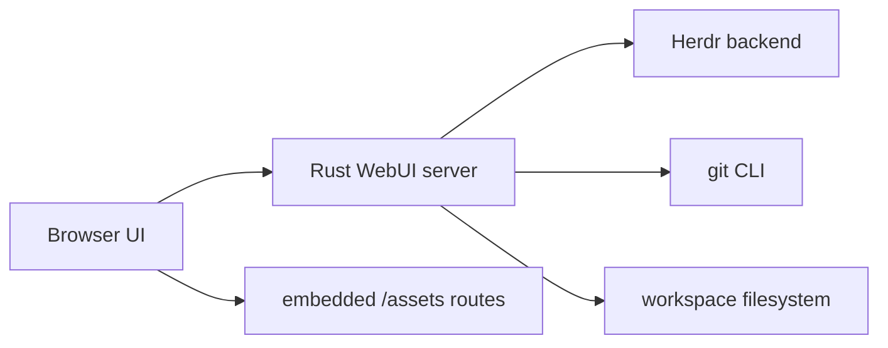

# Technical details

This document records implementation decisions, feature behavior, settings, and performance boundaries for Herdr WebUI.

## Architecture

Herdr WebUI is a Rust Axum server with embedded static assets. The browser connects to Herdr through HTTP and WebSocket endpoints exposed by the WebUI process.

### Backend responsibilities

- Serve embedded HTML, CSS, JavaScript, fonts, and icons from `src/assets.rs` and `src/main.rs` routes.
- Validate file paths before reading or writing.
- List file explorer entries and file search results.
- Calculate Git status for files and directories before sending file tree data.
- Run Git UI operations, diffs, comparisons, cleanup scans, and worktree operations.
- Proxy terminal/session protocol messages to compatible Herdr versions.

### Frontend responsibilities

- Render panes, tabs, sidebars, file trees, editor surfaces, terminal surfaces, and modals.
- Store browser-local UI options in `localStorage`.
- Preserve transient panel state while workspaces/worktrees stay open.
- Keep CodeMirror preview and edit mode behavior consistent.
- Load shared modules once through `app_boot.js`.

## Static asset model

The Rust binary embeds assets with `include_str!` or `include_bytes!`. Public routes are explicit, for example:

- `/assets/app-boot.js`
- `/assets/shared/core.js`
- `/assets/shared/colors.css`
- `/assets/shared/file-icons.js`
- `/assets/shared/file-icons.css`
- `/assets/shared/file-tree.js`
- `/assets/shared/file-content-search.js`
- `/assets/vendor/codemirror.js`
- `/assets/shared/editor.js`
- desktop assets under `/assets/desktop/...`
- mobile assets under `/assets/mobile/...`

`app_boot.js` loads layout CSS, then shared color tokens, shared icon CSS, shared JS, and finally layout-specific JS. File icon data is a shared module loaded before `file-tree.js`, so desktop and mobile use the same mappings. Content-search rendering is also shared, with desktop and mobile owning only controller state and backend calls.

## File explorer

### Search with folder context

When filtering files, the UI does not flatten matching files into a pathless list. It rebuilds the parent directory chain for each match. This keeps the path visible without requiring the full tree to stay expanded.

### Git status propagation

The backend runs one Git porcelain status scan per refresh, maps changed paths, then propagates status to parent folders.

Priority:

1. Deleted or missing paths -> red.
2. Modified, renamed, copied, type changed, conflicted -> yellow.
3. Added or untracked -> green.

The priority is monotonic while walking parents. A parent folder keeps the highest-priority child status. Refresh retriggers calculation from current Git state.

### Why backend calculation

Git status and path propagation depend on repository state, ignore rules, renames, untracked files, and deleted paths. Doing it in Rust avoids browser-side tree scans, avoids duplicate desktop/mobile logic, and returns ready-to-render entries.

### Workspace/worktree state

File explorer state is cached per open workspace/worktree identity. It preserves:

- selected file,
- file search query,
- split pane sizes,
- editing mode,
- unsaved edit draft,
- dirty flag.

When a workspace or worktree closes, the cached state is forgotten. Async file fetches write back to the captured workspace state, so switching panels does not corrupt another workspace panel.

### Content search

The file explorer content Search view is backend-owned for repository traversal and matching. Routes:

- `GET /api/file-browser/content-search`: bounded breadth-first scan from the current file tree root, grouped by file.
- `GET /api/file-browser/content-search/file`: lazy full match load for one file when the group is expanded.
- `POST /api/file-browser/content-search/snippet`: hash-guarded line-range save for an edited match snippet.

Performance limits:

- dependency/build folders such as `.git`, `node_modules`, `target`, `dist`, `build`, `.venv`, and `venv` are skipped,
- traversal is capped by `MAX_CONTENT_SEARCH_VISITS`,
- file reads are skipped above `MAX_CONTENT_SEARCH_FILE_BYTES`,
- binary/NUL content is skipped,
- result page size, context lines, and matches per file are clamped server-side.

Desktop and mobile use `src/assets/shared/file_content_search.js` for grouped rendering, highlight markup, expand/collapse controls, and snippet editor mount IDs. The frontend does not scan repository content. It only sends queries, renders grouped results, and mounts editor instances for requested snippets.

### Theme tokens

Shared theme extension tokens live in `src/assets/shared/colors.css`. New feature colors should use these or existing base variables instead of local hardcoded palettes. Current shared tokens cover focus rings, search hit foreground/background, content match row background, and editor-style panel background.

### File preview and editing

File open uses the same CodeMirror shell as edit mode from the first render. Preview is read-only by default. Edit only changes the editable state and enables save behavior. Cancel returns to the same read-only editor style.

Text files show line numbers by default. The setting can disable them.

### File icons

File icon logic is split into:

- `src/assets/shared/file_icons.js`: file name and extension mapping for file glyphs.
- `src/assets/shared/file_icons.css`: neutral monochrome glyph styling that inherits row color. Normal rows stay grey; Git status rows can color the whole row.
- `src/assets/shared/file_tree.js`: rendering only, with fallback when icon module is unavailable.

No external icon assets are copied. The implementation uses local CSS and short glyph labels for files. Folders keep the plain folder SVG and only change color through backend Git status row classes.

## Editor

The editor stack is CodeMirror. The WebUI preloads `/assets/vendor/codemirror.js` before `/assets/shared/editor.js` so file open can create a CodeMirror DOM immediately.

Supported behavior:

- read-only preview with CodeMirror style,
- edit mode with the same style,
- syntax highlighting by detected language,
- fold gutter and folding keymaps for compatible languages,
- default line numbers for text preview,
- high-contrast syntax palette tokens for light and dark themes,
- fallback numbered `<pre>` rendering if CodeMirror fails to load.

## Settings

Settings are stored in `localStorage` under `herdr-web-options`. Main defaults are defined in `src/assets/desktop/app_js/core.js`.

| Setting | Default | Notes |
| --- | --- | --- |
| `overflow` | `false` | Browser terminal overflow opt-in. |
| `notificationVolume` | `0.24` | Clamped 0 to 1. |
| `browserNotifications` | `false` | Browser notification permission still applies. |
| `shiftEnterNewline` | `true` | Terminal input newline behavior. |
| `closeShortcut` | `off` | Optional close shortcut mode. |
| `globalShortcutsEnabled` | `true` | Enables WebUI global shortcuts. |
| `globalShortcutPrefix` | app default | Prefix for global shortcuts. |
| `webuiShortcuts` | app default | User-overridable shortcut map. |
| `gitShortcuts` | app default | Git UI shortcut map. |
| `searchShortcut` | `off` | Optional search prefix. |
| `terminalFontFamily` | bundled Nerd Font stack | Migrates old monospace default. |
| `terminalLinks` | `true` | Terminal link detection. |
| `agentSortMode` | `off` | Optional attention/status sorting. |
| `agentStatusOrder` | blocked, idle, done, other, working | Custom status grouping order. |
| `sidebarWorkspacePercent` | `68` | Clamped 20 to 80. |
| `parentCloseMode` | `panels` | Parent close policy. |
| `stuckWorkingEnabled` | `true` | Stuck-working warnings. |
| `workingDismissMinutes` | `30` | Clamped 1 to 1440. |
| `workspaceSort` | `default` | Workspace ordering. |
| `scrollLines` | `3` | Terminal wheel/key scroll step, clamped 1 to 20. |
| `treeIndentPx` | `14` | File tree indent, clamped 0 to 40. |
| `fileBrowserAllowParent` | `true` | Show parent navigation. |
| `fileBrowserGitStatus` | `true` | Show backend-provided Git colors. |
| `fileBrowserLineNumbers` | `true` | Show line numbers in file previews. |
| `fileContentSearchContextLines` | `2` | Default lines above/below each content-search match, clamped 0 to 20. |
| `fileContentSearchAutoCollapseFiles` | `8` | Collapse result file groups when file count exceeds this value. 0 disables auto-collapse. |
| `fileContentSearchMatchesPerFile` | `5` | Initial matches loaded per file before lazy expansion, clamped 1 to 50. |
| `showTabActivity` | `false` | Show tab activity age. |
| `worktreeAutoDiscoverSeconds` | `3` | Discovery interval, clamped 0 to 30. |
| `generateWorktreeNames` | `false` | Auto-generate worktree names. |
| `worktreeDefaultDirectory` | empty | Default worktree parent dir. |
| `explorationDefaultDirectory` | empty | Default exploration/open dir. |
| `themeColors` | theme defaults | Normalized color token map. |

Other modules can contribute defaults through the settings module registry.

## Help button coverage

The in-app Help and Shortcuts modal documents user-facing behavior, including:

- terminal shortcuts,
- file explorer tree search, content search, Git color priority, icons, read-only preview, line numbers, folding, and workspace state preservation,
- Git UI actions and diff modes,
- command palette behavior.

When a visible feature is added, update `shortcutsModalHtml()` and tests in `src/assets/app_load.test.mjs`.

## Performance decisions

- Git status and content search are calculated in the backend with traversal/file-size caps.
- Folder status is propagated with a simple parent walk per changed path.
- File-tree icon classification and content-search rendering are shared modules, not copied into desktop and mobile code.
- CodeMirror is loaded once and reused by editor creation calls.
- Browser state is scoped by workspace/worktree to avoid recalculating or leaking edit state across panels.

## Safety decisions

- Path inputs are cleaned before filesystem operations.
- File writes use editor state and backend validation.
- Workspace/worktree close forgets only UI state, not repository data.
- Destructive Git actions are routed through backend commands and UI confirmation paths.
