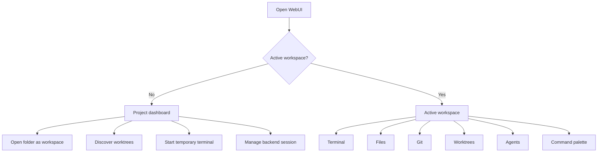

# UX flow proposal

## Scope

This proposal keeps `worktree` as the Git concept. The flow changes focus on first-run guidance, task entry points, mobile navigation, and command-palette actions without renaming Git terms.

## Current UX diagnosis

Herdr WebUI is powerful but currently tool-first:

1. Desktop opens into sidebar plus terminal shell with many compact controls.
2. Mobile exposes seven bottom-nav destinations with equal weight: Workspaces, Agents, Panels, Worktrees, Files, Git, Terminal.
3. First-run and empty-session states do not guide the user toward the next useful action.
4. Search is a strong navigation tool, but it does not yet act as a command launcher.
5. Worktree flows are available, but open/discover/create concepts are dense on mobile.

## Recommended flow: project dashboard first

Use a project dashboard as the default empty and return-home view. Keep the current terminal/files/git/worktree tools, but make the first screen answer: "What do you want to work on?"

## Desktop changes

### P1. Better empty state

When there are no workspaces, replace passive terminal loading/no-selection UI with a dashboard card set:

- Open folder
- Discover worktrees
- Create worktree
- Start temporary terminal
- Manage sessions

Expected impact: high. Effort: low-medium.

### P1. Clarify the `+` button

Current `+` opens the worktree/open modal. Keep behavior if desired, but label it clearly:

- `Open workspace/worktree`
- Tooltip: `Open folder, discover worktrees, or create a worktree`

Alternative: split into two actions:

- `Open`
- `New worktree`

Expected impact: high. Effort: low.

### P2. Command palette actions

Extend the search palette so empty or command-like queries show actions:

- `Open folder`
- `Discover worktrees`
- `Create worktree`
- `Start temporary terminal`
- `Open Git for current workspace`
- `Open Files for current workspace`
- `Manage sessions`

Expected impact: high for power users. Effort: medium.

## Mobile changes

### P1. Task-first home

Keep bottom nav for now, but make Home a task hub:

- Continue active workspace
- Open folder
- Discover worktrees
- Start temporary terminal
- View blocked/done agents

Expected impact: very high. Effort: low-medium.

### P1. Split Worktrees screen into progressive sections

Keep `worktree` wording. Reorganize screen:

1. Discover existing worktrees
2. Results list
3. Collapsed `Create new worktree` form

Do not show branch/base/path/label fields until the user expands create mode.

Expected impact: high. Effort: low.

### P2. Simplify mobile nav

Current seven tabs are complete but busy. Proposed second step:

- Home
- Search
- Terminal
- More

`More` contains Agents, Panels, Worktrees, Files, Git, Settings.

Alternative safer version: keep seven tabs but make Home the main task hub first, then decide from usage.

Expected impact: medium-high. Effort: medium.

### P2. Settings sections

Convert mobile settings groups into accordions or add a filter input. Default collapsed groups:

- Appearance
- Layout
- Files and search
- Workspaces and worktrees
- Alerts
- Terminal
- Data

Expected impact: medium. Effort: low-medium.

## Implementation sequence

1. Add shared dashboard/empty-state renderer for desktop and mobile.
2. Add action entries to search palette and mobile search sheet.
3. Clarify desktop `+` label/tooltip or split button.
4. Refactor mobile Worktrees screen into discover/results/create sections.
5. Add settings accordions/search.
6. Revisit mobile bottom nav after the task-first home ships.

## Validation plan

- Frontend load tests still pass:
  - `node --experimental-vm-modules src/assets/app_load.test.mjs`
  - `node --experimental-vm-modules src/assets/mobile_load.test.mjs`
- Add focused tests for dashboard rendering and command-palette action results.
- Manual desktop checks:
  - no workspace first run
  - existing workspace return
  - worktree discover/open/create
  - temporary terminal
  - session manager
- Manual mobile checks:
  - no workspace first run
  - bottom nav routes
  - worktree discover/open/create
  - search sheet action launch
  - terminal connect/disconnect on navigation

## Non-goals

- Do not rename Git `worktree` concepts.
- Do not remove existing power-user shortcuts.
- Do not replace terminal/files/git implementations.
- Do not redesign backend session protocol.
