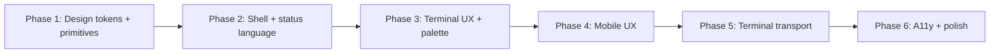

# UX and visual overhaul plan

Extensive plan to raise the UX quality and visual feel of the herdr WebUI, desktop and
mobile. Grounded in the deep research in `research-annotations.md` (our code vs the
reference project <https://github.com/devswha/herdr-web-ui>) and in the flow diagnosis
already written in `../ux-flow-proposal.md`.

Design decisions marked **[DECISION]** need user sign-off before implementation. Sizes:
S = hours, M = 1-3 days, L = 1-2 weeks. Phases are sequential but items inside a phase
are parallelizable.

## Guiding principles (adopted from the reference)

1. **One chrome color.** The accent is reserved for selection, focus, cursor, and the
   user's own primary action. Agent states get their own semantic tokens with tints,
   always with written labels.
2. **Tokens only.** Components never hardcode hex values; everything is a `:root` token.
   Keep a `docs/ux/design-system.md` mirroring the token block (like reference DESIGN.md).
3. **Tonal depth.** Surfaces separate by tone + hairline; shadows only on overlays
   (modals, popovers, drawer) and at most one resting card.
4. **Motion with restraint.** Only state changes move. 120/180ms durations, one pulse
   language (dot breathes, word stands still), full `prefers-reduced-motion` support.
5. **Touch first class.** 40px touch targets on coarse pointers, 16px inputs on mobile
   (no iOS zoom), safe-area insets everywhere, bottom-sheet modals.
6. **Text beats color.** Every status, connection state, and agent state is written
   out; color is never the only signal (WCAG 2.2 AA target).

---

## Phase 1: Design token layer and primitives (foundation)

Everything else depends on this. No visual change yet beyond unification.

### 1.1 Unified token file (M)

- Create `src/assets/shared/tokens.css`: one `:root` block with surfaces, text, accent,
  status (+ tints), spacing (4px base, `--space-1..8`), radii (`--radius-sm/md/lg/xl/pill`),
  type scale (`--fs-2xs..--fs-xl`, `--fs-input: 16px`, weights, tracking), sizes
  (`--control-h`, `--touch-target: 40px`, `--header-h`, `--row-h`, `--chip-h`),
  focus ring, motion (`--dur-fast/base/pulse`, `--ease-out/spring/pulse`), layers
  (`--z-*`), shadows (`--shadow-pop/drawer/card`), terminal theme tokens
  (`--term-bg/fg/cursor/selection`).
- Theme switching: `body.light` overrides only the color group. **[DECISION]** keep
  Catppuccin as base palette or adopt a reference-style identity (single-accent warm
  graphite)? Recommendation: keep Catppuccin hues but apply the one-chrome-color rule
  (drop competing accent uses).
- Delete the duplicated 200+ line token block from `mobile/app.css`; both layouts import
  `tokens.css`. Sweep raw hexes out of `controls.css`, `app.css` into tokens
  (`--status-blocked`, `--danger-tint`, etc.).
- Optional: **[DECISION]** add `[data-density="compact"]` scale override and a Settings
  density toggle (reference pattern; low cost once tokens exist).

### 1.2 Status semantic tokens + badges (S)

- Tokens: `--status-idle/working/blocked/done` + `*-tint` + `--danger-tint/-text`.
  Map existing git colors (`--git-*`) and status classes onto them.
- New `.badge` primitive (shared CSS): uppercase written label
  (`READY`/`RUN`/`INPUT`/`DONE`), tinted bg, `--radius-sm`; RUN carries a breathing dot
  (`animation: pulse 1.6s steps(2, jump-none)`), word never pulses; unknown = dim text +
  dashed border. Replaces ad hoc `sidebar-count` pills and `mobile-chip`.

### 1.3 Unified button system (M) — the "buttons" overhaul

- One `.btn` primitive with variants, shared by desktop and mobile:
  - `.btn` neutral (elevated bg + hairline border)
  - `.btn-primary` (accent fill, `--accent-fg` text)
  - `.btn-danger` (danger tint + blocked border)
  - `.btn-ghost` (transparent)
  - `.btn-sm` modifier for table rows
- `.icon-button`: square, transparent, mandatory `aria-label`, `.is-outlined` variant.
- Consolidate: `mini` -> `.btn.btn-sm`, `git-ui-btn` -> `.btn`, `mobile-btn` ->
  `.btn` + coarse-pointer sizing. Keep old classes as aliases during migration so no JS
  churn in the same PR.
- Interaction contract: hover lift stays (`translateY(-1px)`), but behind a
  `@media (hover: hover)` guard so touch devices do not stick hover; `:active` resets;
  global `:focus-visible { outline: var(--ring); outline-offset: 2px; }` replacing the
  per-selector box-shadow rings.
- `@media (pointer: coarse)`: buttons and icon-buttons grow to `--touch-target`.
- `.kbd` keycap primitive (18px, mono, strong bottom edge) for shortcuts help, palette
  hints, and inline hints.
- `.segmented` control primitive for Chat/Terminal and theme switches.

### 1.4 Design-system doc (S)

- `docs/ux/design-system.md` mirroring the token block, like reference DESIGN.md, with
  the rule "both must not drift".

---

## Phase 2: Shell, status language, command palette (functionality)

### 2.1 Connection state chip (S)

- Header chip: colored dot + written `Live`/`Reconnecting`/`Offline`; reconnecting dot
  pulses; mobile keeps dot only. Reuses the events-socket state already tracked in
  `terminal.js` `cycleEventsSocket` and `mobile/events.js`.

### 2.2 Sidebar roster upgrade (M)

- Two-line pane rows: mark/title line, status badge + placement line.
- 3px selection rail in accent on the selected row (the reference's signature move).
- Arm-then-confirm close: first click arms (3s window, button turns danger), second
  confirms. Replaces immediate destructive closes.
- Workspace headers: numbered, foldable, drag reorder (Alt+Up/Down keyboard
  equivalent).
- Title collapsing: a pane title that is a cwd shows only its last folder; full path in
  tooltip.

### 2.3 Command palette actions (M) — extends `ux-flow-proposal.md` P2

- Empty or `>`-prefixed queries list actions: Open folder, Discover worktrees, Create
  worktree, Start temporary terminal, Open Git, Open Files, Manage sessions, Toggle
  sidebar, Toggle theme, Settings.
- Recent panes lead the empty query; `.kbd` hints where shortcuts exist.
- Mobile: same action list inside the search sheet.

### 2.4 In-app alert card (M)

- Reference "droplet": a pane needing input or finishing a turn drops a black card from
  the top; one at a time, safe-area aware, tap opens pane, swipe/flick up dismisses,
  auto-leaves after ~3.6s, reduced-motion fallback fades. We already have the event
  stream (`attention.js`); this is the missing visual.

---

## Phase 3: Terminal UX and visual (desktop-led)

### 3.1 Terminal surface polish (M)

- Terminal theme tokens (`--term-*`) wired to wterm options so terminal colors follow
  theme changes automatically (today partly manual).
- Loading state: replace plain "Loading panel" text with a spinner + skeleton on
  `--panel` (reuse `shared/skeleton.css`), and an explicit failed state with a
  reconnect `.btn`.
- Follow/Tail button: pill-shaped, elevated, appears only when scrollback diverges
  (behavior already exists; restyle).
- Paste progress bar restyle to token colors; add a subtle scrim over terminal while
  pasting.

### 3.2 Settings: appearance section (S)

- Theme (auto/light/dark) already exists. Add terminal font size (10-22px slider) if
  not present, plus density toggle if adopted in 1.1.

### 3.3 Optional big items **[DECISION]** — pick per appetite

- **Chat lens over terminal** (L): transcript rendered from pane scrollback + structured
  transcripts, centered `--content-w`, over the still-attached terminal; switching lens
  never creates a second connection. Highest-value reference feature but largest effort.
- **Prompt cards** (L): interactive forms for blocked-agent questions translated to
  keypresses. Depends on backend prompt detection; needs a feasibility spike first.

---

## Phase 4: Mobile UX overhaul

### 4.1 Bottom sheet modals (S)

- All modals become bottom sheets at `<=640px`: top `--radius-xl` corners, safe-area
  padding, scrim tap closes. Shared rule in `modals.css` + mobile override.

### 4.2 Mobile key bar (M)

- Above the nav while a terminal is focused: Esc, Tab, one-shot Ctrl (state shown on the
  key), arrows, `^C`. Sends bytes through the existing input WS path
  (`mobile/terminal.js` `enableDirectInput`). Never steals terminal focus: buttons use
  `onmousedown preventDefault`.
- Keyboard-open behavior stays (nav/header hidden), key bar hides too.

### 4.3 Drawer navigation for secondary screens (M) — completes `ux-flow-proposal.md`

- More/Agents/Panels/Worktrees/Files/Git move from the horizontal-scroll nav into a
  drawer: scrim, slide-in, edge swipe (24px open / 56px close travel), tab order removed
  when closed. Home/Search/Terminal stay as 3 fixed bottom items.
- Keep deep links and tests: direct screen routes still reachable.

### 4.4 Mobile restyle pass (S)

- Header: context title + status, backend badge pill, connection dot; label shedding at
  `<=480px`.
- Rows and cards onto token spacing/radius; touch targets audited at 44px minimum.
- Terminal screen: key bar + connection chip + banners (reconnecting, observe) stack
  top-right.

### 4.5 Settings accordion (S) — `ux-flow-proposal.md` P2

- Collapsible groups with a filter input.

---

## Phase 5: Terminal transport robustness (backend, optional but recommended)

Not visual, but UX-visible: fewer stalls and dead-session surprises. Own protocol, keep
wterm.

1. **Shared PTY per terminal** (L): server keeps one attach per terminal_id, fans frames
   to all attached clients, closes when last detaches. Mirrors reference
   `PaneAttachment`. Touches `builtin_backend.rs`/`backend_client.rs`; protocol version
   bump (`PROTOCOL_VERSION` guard exists).
2. **Replay buffer** (M): bounded tail so a late joiner sees the current screen at once.
3. **Input queue policy** (S): stop replaying queued input after a disconnect older than
   N seconds; surface "input was not sent" as a draft for review instead of silently
   firing into a dead session.
4. **Backpressure** (M): pause PTY reads when client send buffers saturate, resume on
   drain; Ctrl+C stays live. portable-pty does not expose pause/resume directly; a
   bounded output buffer in the reader thread gives the same effect.
5. **Explicit stall close code** (S): clients get a distinct close event + banner
   instead of hanging.

## Phase 6: Accessibility and final polish

- Audit pass against the contract: `aria-label` on all icon-only buttons,
  `aria-pressed` on toggles, `aria-current` on selected pane, `role="status"` for live
  states, `role="alert"` for failures, `aria-modal` + Escape/scrim on dialogs, first
  control focused on open.
- Contrast measurement of both themes on every actual backing surface (WCAG AA target);
  fix token values that fail.
- `prefers-reduced-motion` global block: kill pulse, drawer/control transitions,
  hover lift.
- E2E: extend `scripts/e2e/` acceptance suites — theme, settings-confirm (mobile),
  session-ux already exist; add badge/status-chip assertions and modal bottom-sheet
  layout checks.
- Update `docs/ux/design-system.md` and `docs/features.md` screenshots after polish.

---

## Suggested sequencing and effort

| Phase | Items | Effort | Visible win |
|---|---|---|---|
| 1 | tokens, badges, buttons, kbd, segmented, doc | ~1.5 wk | consistency foundation |
| 2 | conn chip, roster, palette actions, alert card | ~1.5 wk | immediate "feels designed" |
| 3 | terminal polish, appearance settings (+ optional lens/prompt cards) | 1 wk (+ L each) | the hero surface |
| 4 | bottom sheets, key bar, drawer, restyle, settings accordion | ~2 wk | mobile parity with reference |
| 5 | transport (shared PTY, replay, input policy, backpressure) | ~2 wk | reliability UX |
| 6 | a11y audit, contrast, reduced motion, e2e | ~1 wk | quality gate |

Non-goals (kept from `ux-flow-proposal.md`): do not rename `worktree` terms, do not
remove power shortcuts, do not replace terminal/files/git implementations, do not swap
wterm for xterm.

## Validation

- `node --experimental-vm-modules src/assets/app_load.test.mjs` and
  `src/assets/mobile_load.test.mjs` after every phase.
- Existing acceptance scripts (`run-theme-e2e.sh`, `settings-confirm-*`,
  `session-ux-acceptance.mjs`, `mobile-*`) keep passing; add new assertions per phase.
- Manual: both themes, both layouts, narrow widths (480/640/760/768), iOS Safari
  keyboard, reduced-motion toggle.
